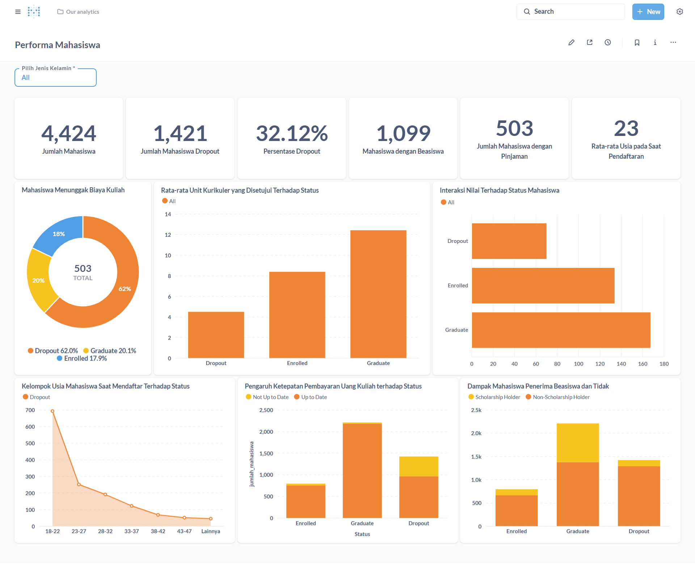

# Proyek Akhir: Menyelesaikan Permasalahan Universitas Jaya Jaya

## Business Understanding

Universitas Jaya Jaya merupakan salah satu institusi pendidikan tinggi yang telah berdiri sejak tahun 2000. Selama lebih dari dua dekade, universitas ini telah berhasil meluluskan banyak mahasiswa dengan prestasi akademik yang membanggakan.

Namun demikian, dalam perjalanannya, Universitas Jaya Jaya menghadapi tantangan serius terkait tingginya angka mahasiswa yang tidak menyelesaikan studi mereka (dropout). Fenomena ini menjadi perhatian besar karena dapat berdampak buruk terhadap reputasi universitas serta menurunkan tingkat kelulusan secara keseluruhan.

Untuk mengatasi masalah ini, pihak universitas berinisiatif untuk melakukan analisis data terhadap performa akademik mahasiswa. Tujuannya adalah untuk:
- Mendeteksi mahasiswa yang berisiko tinggi mengalami dropout sedini mungkin.
- Memberikan intervensi atau bimbingan akademik yang tepat sasaran.
- Meningkatkan angka retensi dan kelulusan mahasiswa.

Sebagai bagian dari solusi, tim data science diminta untuk menganalisis dataset mahasiswa yang telah disediakan. Selain itu, juga diharapkan untuk membangun sebuah dashboard interaktif yang dapat membantu pihak universitas dalam memahami pola-pola performa mahasiswa serta memantau perkembangan mereka secara berkala.

### Permasalahan Bisnis
Universitas Jaya Jaya menghadapi beberapa **permasalahan bisnis utama** yang perlu diselesaikan, yaitu:
1. **Tingginya angka mahasiswa yang tidak menyelesaikan studi mereka (dropout)**, yang dapat berdampak negatif pada reputasi universitas.
2. **Kurangnya sistem deteksi dini** untuk mengidentifikasi mahasiswa yang berisiko tinggi mengalami dropout.
3. **Tidak adanya mekanisme intervensi yang efektif** untuk membantu mahasiswa yang berisiko agar dapat melanjutkan studi mereka.
4. **Keterbatasan dalam memahami pola-pola performa akademik mahasiswa** secara menyeluruh.
5. **Tidak adanya alat bantu seperti dashboard interaktif** untuk memantau perkembangan mahasiswa secara berkala.

**Solusi yang diharapkan** adalah analisis data yang mendalam dan pengembangan sistem berbasis data untuk mengatasi permasalahan ini.

### Cakupan Proyek

Proyek ini mencakup beberapa langkah utama untuk menyelesaikan permasalahan yang dihadapi Universitas Jaya Jaya, yaitu:

1. **Eksplorasi dan Pembersihan Data**  
    - Mengumpulkan dan memahami dataset mahasiswa yang telah disediakan.  
    - Melakukan pembersihan data untuk memastikan kualitas data yang digunakan dalam analisis.  

2. **Analisis Data**  
    - Melakukan analisis eksplorasi data (EDA) untuk mengidentifikasi pola-pola performa akademik mahasiswa.  
    - Menggunakan teknik statistik dan visualisasi data untuk menemukan faktor-faktor yang berkontribusi terhadap risiko dropout.  

3. **Pengembangan Model Prediktif**  
    - Membangun model machine learning untuk mendeteksi mahasiswa yang berisiko tinggi mengalami dropout.  
    - Melakukan evaluasi model untuk memastikan akurasi dan keandalannya.  

4. **Pembuatan Dashboard Interaktif**  
    - Mengembangkan dashboard berbasis web yang dapat digunakan oleh pihak universitas untuk memantau performa mahasiswa.  
    - Menyediakan fitur-fitur seperti visualisasi data, laporan perkembangan, dan notifikasi risiko dropout.  

5. **Dokumentasi dan Deployment**  
    - Menyusun dokumentasi lengkap terkait proses analisis dan pengembangan sistem.  
    - Melakukan deployment sistem machine learning dan dashboard agar dapat diakses oleh pihak universitas.  

6. **Rekomendasi Action Items**  
    - Memberikan rekomendasi berbasis data untuk intervensi yang efektif.  
    
### Persiapan

#### Sumber Data
Dataset yang digunakan dalam proyek ini berasal dari [Dicoding Dataset](https://github.com/dicodingacademy/dicoding_dataset/blob/main/students_performance/README.md), yang mencakup informasi akademik mahasiswa seperti nilai, kehadiran, aktivitas ekstrakurikuler, dan data demografis. Dataset ini telah dianonimkan untuk menjaga kerahasiaan data pribadi mahasiswa.

**Penjelasan Fitur Dataset**  
Dataset ini terdiri dari beberapa kolom dengan deskripsi sebagai berikut:

| **Kolom**                                   | **Deskripsi**                                                                                     | **Keterangan Nilai**                                                                                   |
|---------------------------------------------|---------------------------------------------------------------------------------------------------|--------------------------------------------------------------------------------------------------------|
| Marital_status                              | Status pernikahan mahasiswa. (Kategorikal)                                                       | 1 = single, 2 = married, 3 = widower, 4 = divorced, 5 = facto union, 6 = legally separated             |
| Application_mode                            | Metode aplikasi yang digunakan oleh mahasiswa. (Kategorikal)                                     | 1 = Tahap pertama - kontingen umum, 2 = Peraturan No. 612/93, 5 = Tahap pertama - kontingen khusus (Pulau Azores), 7 = Pemegang gelar pendidikan tinggi lainnya, 10 = Peraturan No. 854-B/99, 15 = Mahasiswa internasional (sarjana), 16 = Tahap pertama - kontingen khusus (Pulau Madeira), 17 = Tahap kedua - kontingen umum, 18 = Tahap ketiga - kontingen umum, 26 = Peraturan No. 533-A/99, item b2) (Rencana Berbeda), 27 = Peraturan No. 533-A/99, item b3 (Institusi Lain), 39 = Usia di atas 23 tahun, 42 = Transfer, 43 = Perubahan program studi, 44 = Pemegang diploma spesialisasi teknologi, 51 = Perubahan institusi/program studi, 53 = Pemegang diploma siklus pendek, 57 = Perubahan institusi/program studi (Internasional) |
| Application_order                           | Urutan aplikasi mahasiswa. (Numerikal)                                                          | Nilai antara 0 (pilihan pertama) hingga 9 (pilihan terakhir)                                           |
| Course                                      | Program studi yang diambil oleh mahasiswa. (Kategorikal)                                         | 33 = Teknologi Produksi Bahan Bakar Nabati, 171 = Desain Animasi dan Multimedia, 8014 = Pelayanan Sosial (kelas malam), 9003 = Agronomi, 9070 = Desain Komunikasi, 9085 = Keperawatan Hewan, 9119 = Teknik Informatika, 9130 = Equinkultur, 9147 = Manajemen, 9238 = Pelayanan Sosial, 9254 = Pariwisata, 9500 = Keperawatan, 9556 = Kebersihan Mulut, 9670 = Manajemen Periklanan dan Pemasaran, 9773 = Jurnalisme dan Komunikasi, 9853 = Pendidikan Dasar, 9991 = Manajemen (kelas malam) |
| Daytime_evening_attendance                  | Kehadiran mahasiswa (siang/malam). (Kategorikal)                                                 | 1 = siang, 0 = malam                                                                                  |
| Previous_qualification                      | Kualifikasi pendidikan sebelumnya. (Kategorikal)                                                | 1 = Pendidikan menengah, 2 = Pendidikan tinggi - gelar sarjana muda, 3 = Pendidikan tinggi - gelar sarjana, 4 = Pendidikan tinggi - gelar magister, 5 = Pendidikan tinggi - gelar doktor, 6 = Frekuensi pendidikan tinggi, 9 = Tahun ke-12 pendidikan sekolah - belum selesai, 10 = Tahun ke-11 pendidikan sekolah - belum selesai, 12 = Lainnya - Tahun ke-11 pendidikan sekolah, 14 = Tahun ke-10 pendidikan sekolah, 15 = Tahun ke-10 pendidikan sekolah - belum selesai, 19 = Pendidikan dasar siklus ke-3 (tahun ke-9/ke-10/ke-11) atau setara, 38 = Pendidikan dasar siklus ke-2 (tahun ke-6/ke-7/ke-8) atau setara, 39 = Kursus spesialisasi teknologi, 40 = Pendidikan tinggi - gelar sarjana (siklus pertama), 42 = Kursus teknis profesional tingkat tinggi, 43 = Pendidikan tinggi - gelar magister (siklus kedua) |
| Previous_qualification_grade                | Nilai kualifikasi pendidikan sebelumnya. (Numerikal)                                            | Nilai antara 0 hingga 200                                                                             |
| Nationality                                 | Kewarganegaraan mahasiswa. (Kategorikal)                                                        | 1 = Portugis, 2 = Jerman, 6 = Spanyol, 11 = Italia, 13 = Belanda, 14 = Inggris, 17 = Lituania, 21 = Angola, 22 = Tanjung Verde, 24 = Guinea, 25 = Mozambik, 26 = Sao Tome, 32 = Turki, 41 = Brasil, 62 = Rumania, 100 = Moldova (Republik), 101 = Meksiko, 103 = Ukraina, 105 = Rusia, 108 = Kuba, 109 = Kolombia |
| Mothers_qualification                       | Kualifikasi pendidikan ibu mahasiswa. (Kategorikal)                                             | 1 = Pendidikan Menengah - Tahun ke-12 Sekolah atau Setara, 2 = Pendidikan Tinggi - Gelar Sarjana Muda, 3 = Pendidikan Tinggi - Gelar Sarjana, 4 = Pendidikan Tinggi - Gelar Magister, 5 = Pendidikan Tinggi - Gelar Doktor, 6 = Frekuensi Pendidikan Tinggi, 9 = Tahun ke-12 Sekolah - Belum Selesai, 10 = Tahun ke-11 Sekolah - Belum Selesai, 11 = Tahun ke-7 (Lama), 12 = Lainnya - Tahun ke-11 Sekolah, 14 = Tahun ke-10 Sekolah, 18 = Kursus perdagangan umum, 19 = Pendidikan Dasar Siklus ke-3 (Tahun ke-9/ke-10/ke-11) atau Setara, 22 = Kursus teknis-profesional, 26 = Tahun ke-7 Sekolah, 27 = Siklus ke-2 dari kursus sekolah menengah umum, 29 = Tahun ke-9 Sekolah - Belum Selesai, 30 = Tahun ke-8 Sekolah, 34 = Tidak Diketahui, 35 = Tidak Bisa Membaca atau Menulis, 36 = Bisa Membaca Tanpa Memiliki Tahun ke-4 Sekolah, 37 = Pendidikan
| Fathers_qualification                       | Kualifikasi pendidikan ayah mahasiswa. (Kategorikal)                                            | 1 = Secondary Education - 12th Year of Schooling or Eq., 2 = Higher Education - Bachelor's Degree, 3 = Higher Education - Degree, 4 = Higher Education - Master's, 5 = Higher Education - Doctorate, 6 = Frequency of Higher Education, 9 = 12th Year of Schooling - Not Completed, 10 = 11th Year of Schooling - Not Completed, 11 = 7th Year (Old), 12 = Other - 11th Year of Schooling, 13 = 2nd year complementary high school course, 14 = 10th Year of Schooling, 18 = General commerce course, 19 = Basic Education 3rd Cycle (9th/10th/11th Year) or Equiv., 20 = Complementary High School Course, 22 = Technical-professional course, 25 = Complementary High School Course - not concluded, 26 = 7th year of schooling, 27 = 2nd cycle of the general high school course, 29 = 9th Year of Schooling - Not Completed, 30 = 8th year of schooling, 31 = General Course of Administration and Commerce, 33 = Supplementary Accounting and Administration, 34 = Unknown, 35 = Can't read or write, 36 = Can read without having a 4th year of schooling, 37 = Basic education 1st cycle (4th/5th year) or equiv., 38 = Basic Education 2nd Cycle (6th/7th/8th Year) or Equiv., 39 = Technological specialization course, 40 = Higher education - degree (1st cycle), 41 = Specialized higher studies course, 42 = Professional higher technical course, 43 = Higher Education - Master (2nd cycle), 44 = Higher Education - Doctorate (3rd cycle) |
| Mothers_occupation                          | Pekerjaan ibu mahasiswa. (Kategorikal)                                                          | 0 = Student, 1 = Representatives of the Legislative Power and Executive Bodies, Directors, Directors and Executive Managers, 2 = Specialists in Intellectual and Scientific Activities, 3 = Intermediate Level Technicians and Professions, 4 = Administrative staff, 5 = Personal Services, Security and Safety Workers and Sellers, 6 = Farmers and Skilled Workers in Agriculture, Fisheries and Forestry, 7 = Skilled Workers in Industry, Construction and Craftsmen, 8 = Installation and Machine Operators and Assembly Workers, 9 = Unskilled Workers, 10 = Armed Forces Professions, 90 = Other Situation, 99 = (blank), 122 = Health professionals, 123 = teachers, 125 = Specialists in information and communication technologies (ICT), 131 = Intermediate level science and engineering technicians and professions, 132 = Technicians and professionals, of intermediate level of health, 134 = Intermediate level technicians from legal, social, sports, cultural and similar services, 141 = Office workers, secretaries in general and data processing operators, 143 = Data, accounting, statistical, financial services and registry-related operators, 144 = Other administrative support staff, 151 = personal service workers, 152 = sellers, 153 = Personal care workers and the like, 171 = Skilled construction workers and the like, except electricians, 173 = Skilled workers in printing, precision instrument manufacturing, jewelers, artisans and the like, 175 = Workers in food processing, woodworking, clothing and other industries and crafts, 191 = cleaning workers, 192 = Unskilled workers in agriculture, animal production, fisheries and forestry, 193 = Unskilled workers in extractive industry, construction, manufacturing and transport, 194 = Meal preparation assistants |
| Fathers_occupation                          | Pekerjaan ayah mahasiswa. (Kategorikal)                                                         | 0 = Student, 1 = Representatives of the Legislative Power and Executive Bodies, Directors, Directors and Executive Managers, 2 = Specialists in Intellectual and Scientific Activities, 3 = Intermediate Level Technicians and Professions, 4 = Administrative staff, 5 = Personal Services, Security and Safety Workers and Sellers, 6 = Farmers and Skilled Workers in Agriculture, Fisheries and Forestry, 7 = Skilled Workers in Industry, Construction and Craftsmen, 8 = Installation and Machine Operators and Assembly Workers, 9 = Unskilled Workers, 10 = Armed Forces Professions, 90 = Other Situation, 99 = (blank), 101 = Armed Forces Officers, 102 = Armed Forces Sergeants, 103 = Other Armed Forces personnel, 112 = Directors of administrative and commercial services, 114 = Hotel, catering, trade and other services directors, 121 = Specialists in the physical sciences, mathematics, engineering and related techniques, 122 = Health professionals, 123 = teachers, 124 = Specialists in finance, accounting, administrative organization, public and commercial relations, 131 = Intermediate level science and engineering technicians and professions, 132 = Technicians and professionals, of intermediate level of health, 134 = Intermediate level technicians from legal, social, sports, cultural and similar services, 135 = Information and communication technology technicians, 141 = Office workers, secretaries in general and data processing operators, 143 = Data, accounting, statistical, financial services and registry-related operators, 144 = Other administrative support staff, 151 = personal service workers, 152 = sellers, 153 = Personal care workers and the like, 154 = Protection and security services personnel, 161 = Market-oriented farmers and skilled agricultural and animal production workers, 163 = Farmers, livestock keepers, fishermen, hunters and gatherers, subsistence, 171 = Skilled construction workers and the like, except electricians, 172 = Skilled workers in metallurgy, metalworking and similar, 174 = Skilled workers in electricity and electronics, 175 = Workers in food processing, woodworking, clothing and other industries and crafts, 181 = Fixed plant and machine operators, 182 = assembly workers, 183 = Vehicle drivers and mobile equipment operators, 192 = Unskilled workers in agriculture, animal production, fisheries and forestry, 193 = Unskilled workers in extractive industry, construction, manufacturing and transport, 194 = Meal preparation assistants, 195 = Street vendors (except food) and street service providers |
| Admission_grade                             | Nilai penerimaan mahasiswa. (Numerikal)                                                         | Nilai antara 0 hingga 200                                                                             |
| Displaced                                   | Apakah mahasiswa berasal dari luar daerah. (Kategorikal)                                        | 1 = yes, 0 = no                                                                                       |
| Educational_special_needs                   | Apakah mahasiswa memiliki kebutuhan pendidikan khusus. (Kategorikal)                            | 1 = yes, 0 = no                                                                                       |
| Debtor                                      | Apakah mahasiswa memiliki tunggakan. (Kategorikal)                                              | 1 = yes, 0 = no                                                                                       |
| Tuition_fees_up_to_date                     | Apakah pembayaran biaya kuliah mahasiswa sudah lunas. (Kategorikal)                             | 1 = yes, 0 = no                                                                                       |
| Gender                                      | Jenis kelamin mahasiswa. (Kategorikal)                                                          | 1 = male, 0 = female                                                                                   |
| Scholarship_holder                          | Apakah mahasiswa adalah penerima beasiswa. (Kategorikal)                                        | 1 = yes, 0 = no                                                                                       |
| Age_at_enrollment                           | Usia mahasiswa saat mendaftar. (Numerikal)                                                      | Nilai numerikal                                                                                        |
| International                               | Apakah mahasiswa adalah mahasiswa internasional. (Kategorikal)                                  | 1 = yes, 0 = no                                                                                       |
| Curricular_units_1st_sem_credited           | Jumlah mata kuliah yang diakui pada semester pertama. (Numerikal)                               | Nilai numerikal                                                                                        |
| Curricular_units_1st_sem_enrolled           | Jumlah mata kuliah yang diambil pada semester pertama. (Numerikal)                              | Nilai numerikal                                                                                        |
| Curricular_units_1st_sem_evaluations        | Jumlah mata kuliah yang dievaluasi pada semester pertama. (Numerikal)                           | Nilai numerikal                                                                                        |
| Curricular_units_1st_sem_approved           | Jumlah mata kuliah yang disetujui pada semester pertama. (Numerikal)                            | Nilai numerikal                                                                                        |

Dengan tabel di atas, setiap fitur dataset dijelaskan secara rinci, termasuk keterangan nilai kategorikal untuk mempermudah pemahaman.

#### Setup Environment

Untuk menjalankan proyek ini, Anda perlu menyiapkan lingkungan pengembangan dengan langkah-langkah berikut:

1. **Persyaratan Sistem**  
    Pastikan Anda memiliki sistem operasi yang mendukung Python 3.8 atau versi lebih baru.

2. **Instalasi Python**  
    Unduh dan instal Python dari [python.org](https://www.python.org/). Pastikan untuk menambahkan Python ke PATH selama instalasi.

3. **Membuat Virtual Environment**  
    Buat lingkungan virtual untuk mengisolasi dependensi proyek:
    ```bash
    python -m venv env
    source env/bin/activate  # Untuk Linux/MacOS
    env\Scripts\activate     # Untuk Windows
    ```

4. **Menginstal Dependensi**  
    Instal semua dependensi yang diperlukan menggunakan file `requirements.txt`:
    ```bash
    pip install -r requirements.txt
    ```

5 **Menjalankan Notebook Jupyter**  
    Jika proyek menggunakan Jupyter Notebook, instal Jupyter dan jalankan:
    ```bash
    pip install jupyter
    jupyter notebook
    ```

Dengan langkah-langkah di atas, Anda siap untuk memulai proyek ini.

---

## Business Dashboard



Dashboard ini dibuat untuk memantau **Performa Mahasiswa** di Universitas Jaya Jaya berdasarkan berbagai indikator penting, khususnya dalam upaya mengurangi tingkat dropout dan meningkatkan kualitas pendidikan.

### Penjelasan Data dan Pentingnya Fitur

Semua metrik yang divisualisasikan pada dashboard telah melalui tahapan **Exploratory Data Analysis (EDA)** untuk memastikan relevansi dan kualitas data. Berikut adalah beberapa fitur penting yang digunakan dan alasan mengapa fitur tersebut signifikan:

- **Interaction_CU_1st_2nd_Grade** memiliki korelasi tertinggi terhadap status mahasiswa (0.5908). Fitur ini menunjukkan hubungan antara nilai interaksi kurikuler dengan kemungkinan mahasiswa untuk lulus atau dropout.
- **Total_CU_Approved** dan **Total_CU_Grade** juga memiliki korelasi tinggi, yang menunjukkan bahwa performa akademik secara keseluruhan sangat memengaruhi status mahasiswa.
- **Tuition_fees_up_to_date** (0.4098) menunjukkan bahwa mahasiswa yang membayar biaya kuliah tepat waktu cenderung memiliki peluang lebih besar untuk lulus.
- **Scholarship_holder** (0.2976) memberikan insight bahwa penerima beasiswa memiliki tingkat kelulusan yang lebih tinggi dibandingkan mahasiswa tanpa beasiswa.
- **Age_at_enrollment** (-0.2434) menunjukkan bahwa usia saat pendaftaran dapat memengaruhi status mahasiswa, di mana mahasiswa yang lebih tua cenderung memiliki risiko dropout lebih tinggi.

### Insight 

Dari hasil EDA, beberapa fitur penting yang diperlukan untuk memantau performa mahasiswa adalah:
- **Dropout Rate**: Sebanyak 32.12% mahasiswa mengalami dropout, yang menjadi fokus utama untuk ditangani.
- **Dampak Beasiswa**: Mahasiswa penerima beasiswa memiliki tingkat kelulusan yang lebih tinggi (835 lulusan) dibandingkan mahasiswa tanpa beasiswa.
- **Kewajiban Keuangan**: Mahasiswa tanpa tunggakan memiliki tingkat kelulusan yang jauh lebih tinggi (2108 lulusan) dibandingkan yang memiliki tunggakan.
- **Usia Saat Pendaftaran**: Mahasiswa yang lebih muda (usia rata-rata 21.78 tahun) memiliki peluang lebih besar untuk lulus dibandingkan mahasiswa yang lebih tua.

### Komponen Dashboard

Dashboard terdiri dari beberapa komponen utama:

- **Jumlah Mahasiswa Total**  
    Menampilkan total mahasiswa aktif dalam dataset.

- **Jumlah Mahasiswa Dropout**  
    Menunjukkan berapa banyak mahasiswa yang tidak menyelesaikan kuliah mereka.

- **Persentase Dropout**  
    Menghitung persentase mahasiswa yang dropout dibandingkan dengan total mahasiswa.

- **Jumlah Mahasiswa Penerima Beasiswa**  
    Memberikan informasi jumlah mahasiswa yang mendapatkan beasiswa.

- **Jumlah Mahasiswa dengan Tunggakan**  
    Menampilkan jumlah mahasiswa yang memiliki pinjaman atau tunggakan pembayaran.

- **Rata-rata Usia Saat Pendaftaran**  
    Memberikan gambaran rata-rata usia mahasiswa saat pertama kali mendaftar.

### Visualisasi yang Ditampilkan:

- **Donut Chart Mahasiswa Menunggak Biaya Kuliah**  
    Memberikan distribusi persentase mahasiswa yang menunggak berdasarkan status akademik (Dropout, Enrolled, Graduate).

- **Bar Chart Rata-rata Unit Kurikuler Disetujui per Status**  
    Menunjukkan rata-rata jumlah unit kurikuler yang disetujui untuk tiap status mahasiswa.

- **Bar Chart Interaksi Nilai terhadap Status**  
    Memvisualisasikan hubungan antara jumlah nilai (grade) dan status mahasiswa.

- **Line Chart Kelompok Usia Saat Mendaftar terhadap Status**  
    Menampilkan hubungan kelompok umur dengan status mahasiswa (banyaknya dropout pada usia tertentu).

- **Bar Chart Pengaruh Ketepatan Pembayaran terhadap Status**  
    Membandingkan mahasiswa yang membayar tepat waktu dengan yang tidak, dikategorikan berdasarkan status mereka.

- **Bar Chart Dampak Penerimaan Beasiswa terhadap Status**  
    Menunjukkan seberapa besar pengaruh beasiswa terhadap kemungkinan mahasiswa untuk terus berkuliah atau dropout.

Pada dashboard saya juga menerapkan filter data berdasarkan gender mahasiswa dengan pilihan All, male dan female. Hal ini dilakukan untuk melihat perbandingan kelulusan dan dropout pada gender tersebut.

---

## Menjalankan Sistem Machine Learning
Untuk menjalankan prototipe sistem machine learning yang telah dikembangkan, berikut adalah langkah-langkahnya:

### Model yang Digunakan
Data yang digunakan pada aplikasi ini telah melalui evaluasi terhadap lima model machine learning berikut:

| Model                | Accuracy | Precision | Recall | F1 Score |
|----------------------|----------|-----------|--------|----------|
| GaussianNB           | 0.85     | 0.85      | 0.85   | 0.85     |
| Logistic Regression  | 0.91     | 0.91      | 0.91   | 0.91     |
| Random Forest        | 0.90     | 0.90      | 0.90   | 0.90     |
| XGBoost              | 0.90     | 0.90      | 0.90   | 0.90     |
| SVC                  | 0.90     | 0.90      | 0.90   | 0.90     |

**Kesimpulan:**  
Model Logistic Regression memberikan performa terbaik secara keseluruhan pada data uji, diikuti oleh Random Forest, XGBoost, dan SVC. GaussianNB memiliki performa yang sedikit lebih rendah. Oleh karena itu, Logistic Regression dipilih sebagai model akhir karena keseimbangan antara akurasi, precision, recall, dan f1-score.

### Menjalankan Aplikasi Streamlit
Aplikasi yang dikembangkan menggunakan Streamlit untuk memvisualisasikan hasil prediksi. Ikuti langkah-langkah berikut untuk menjalankan aplikasi:

1. **Menjalankan Aplikasi Streamlit**  
    Jalankan perintah berikut di terminal untuk memulai aplikasi Streamlit:
    ```bash
    streamlit run app.py
    ```

2. **Mengakses Aplikasi**  
    Setelah aplikasi berjalan, Anda dapat mengaksesnya melalui browser pada URL berikut:
    ```
    http://localhost:8501
    ```

3. **Mengisi Data Mahasiswa**  
    Pada halaman aplikasi, terdapat form yang memungkinkan pengguna untuk mengisi data mahasiswa berdasarkan metrik yang diperlukan. Setelah semua data diisi, tekan tombol **Prediksi Output**.

4. **Melihat Hasil Prediksi**  
    Setelah tombol ditekan, hasil prediksi akan ditampilkan, menunjukkan apakah mahasiswa tersebut berisiko mengalami dropout atau tidak.

5. **Melihat Data yang Telah Diinput**  
    Aplikasi juga menyediakan tabel atau dataframe yang menampilkan data yang telah diinput oleh pengguna, termasuk hasil scaling yang diterapkan pada data tersebut.

Dengan langkah-langkah di atas, Anda dapat menjalankan aplikasi Streamlit dan memanfaatkan sistem machine learning yang telah dikembangkan.


## Conclusion
Proyek ini berhasil memberikan solusi berbasis data untuk mengatasi permasalahan dropout di Universitas Jaya Jaya. Dengan menggunakan analisis data, pengembangan model prediktif, dan pembuatan dashboard interaktif, universitas kini memiliki alat yang lebih baik untuk memahami pola performa mahasiswa, mendeteksi risiko dropout, dan mengambil langkah intervensi yang tepat. Model Logistic Regression yang digunakan menunjukkan performa terbaik dengan akurasi tinggi, sehingga dapat diandalkan untuk prediksi risiko dropout.

### Rekomendasi Action Items
Berikut adalah beberapa rekomendasi yang dapat dilakukan oleh Universitas Jaya Jaya untuk menyelesaikan permasalahan dan mencapai target mereka:
- **Implementasi Sistem Prediksi**: Terapkan model prediktif secara langsung dalam sistem universitas untuk mendeteksi mahasiswa berisiko tinggi secara real-time.
- **Pengembangan Program Intervensi**: Buat program bimbingan akademik dan konseling khusus untuk mahasiswa yang teridentifikasi berisiko tinggi mengalami dropout.
- **Peningkatan Beasiswa**: Tingkatkan jumlah penerima beasiswa untuk mendukung mahasiswa yang membutuhkan bantuan finansial, karena terbukti dapat meningkatkan tingkat kelulusan.
- **Monitoring Berbasis Dashboard**: Gunakan dashboard interaktif secara rutin untuk memantau performa mahasiswa dan mengambil keputusan berbasis data.
- **Peningkatan Kesadaran Keuangan**: Edukasi mahasiswa tentang pentingnya pembayaran tepat waktu untuk mengurangi risiko dropout terkait masalah keuangan.
- **Evaluasi Berkala**: Lakukan evaluasi berkala terhadap model prediktif dan dashboard untuk memastikan relevansi dan akurasi sistem seiring waktu.

Dengan langkah-langkah ini, Universitas Jaya Jaya dapat meningkatkan angka retensi dan kelulusan mahasiswa secara signifikan.